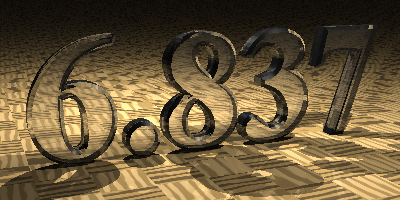
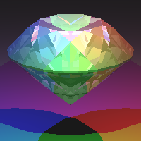

# 6.837 Intro to Computer Graphics, Fall 2004

Course Calendar:

https://groups.csail.mit.edu/graphics/classes/6.837/F04/calendar.html

---

## Introduction

This is a rather old course, but cause the basic idea behind computer graphics did not change that much, it is still a good start for anyone interested in that. (And it's not that easy to get access to the high-quality course material even now.)

What will you do in the course..

- In assignment 0, you will get to know more about the self-similar fractals.
- In assignment 1-4, you will get a basic ray tracer!
- Assignment 5-7 will give your program more speed and higher quality.
- Assignment 8 focuses on the curve, and 9 give your the chance to implemented a particle system!

## Let's Get Started!

### > Start the project on your own..

This repository may help save you some time downloading the code file or slides.

The code lies in [**lectures**](Original Files\lectures) while the slides in [**tasks**](Original Files\tasks).

If you are interested in this project, **PR welcome**!

### > If you need some base code..

I plan to leave some blanks that student can easily "fill in" instead of write the whole structure.

Now, I finished [**My Result**](My Result). You can search for "TODO0" for what you need to do for assignment 0; "TODO1" for assignment 1.

#### Setup

- 常规-C/C++-附加包含库目录
  - **StaticLib**: "..\staticlib;"
  - **StaticLib_raytracer**: "..\common;..\raytracer\obj;..\raytracer;..\staticlib"
  - **assignment**: "..\common;..\raytracer;..\raytracer\obj;"
- Then you will get pch file missing error (if expected)
  - **StaticLib** & **StaticLib_raytracer**: Properties - C/C++ - precompiled header file - Precompiled Header: Select Use (/Yu) 
  - **StaticLib** & **StaticLib_raytracer**: 配置属性 - C/C++ - 预编译头：创建（/Yu）
- Add lib
  - **assignment**: 配置属性 - VC++ 目录 - 库目录 - "..\lib;"
  - 链接器 - 输入 - 附加依赖项 - glut32.lib
- 修改项目属性 - 调试 - 工作路径 “$(ProjectDir)..\assignment0”
- Add glut32.dll to execute folder (start from assignment3)
- Set desired startup project

#### Execute

- Edit Configuration Property - Debugging - Command  Argument (配置属性-调试-命令参数)
  - input looks like “-input scene6_01_sphere.txt -output output6_01c.tga -size 200 200 -grid 10 10 10 -visualize_grid”
- If a function has assert(0) - this function should be pure virtual, but cause in previous assignment need to instance such abstract class, I leave it this way.
- Rebuild the project when change startup project (this is a bad design in the code, I generate the mid result in same folder)

## Other Resources

- [Ray Tracing in One Weekend](https://raytracing.github.io/books/RayTracingInOneWeekend.html)
- [PBRT] Physically Based Rendering, Second Edition: From Theory To Implementation. Pharr, Matt and Humphreys, Greg. 2010.

